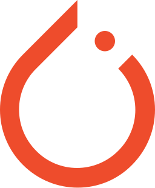
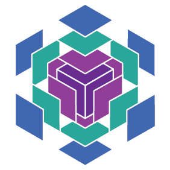

<em>Courses</em>

:::{layout="[[5, 5], [5, 5], [5, -5]]"}

:::{.card .mb-3}

:::{.card-body2}

[Getting started with &nbsp;{width="1em"}](top_pt.qmd){.card-title2 .stretched-link}

[An intro course to DL with PyTorch]{.text-muted}

:::

:::

:::{.card .mb-3}

:::{.card-body2}

[Fast computing with {width="1.6em"}](top_jx.qmd){.card-title2 .stretched-link}

[An intro course to JAX]{.text-muted}

:::

:::

:::{.card .mb-3}

:::{.card-body2}

[JAX NN with {width="1.4em"}](top_fl.qmd){.card-title2 .stretched-link}

[A DL course with Flax]{.text-muted}

:::

:::

:::{.card .mb-3}

:::{.card-body2}

[Deep learning with &nbsp;{width="1.2em"}](top_jxai.qmd){.card-title2 .stretched-link}

[Training models with the JAX AI stack]{.text-muted}

:::

:::

:::{.card .mb-3}

:::{.card-body2}

[A brief overview of &nbsp;{width="2em"}](sk_intro.qmd){.card-title2 .stretched-link}

[Traditional ML with scikit-learn]{.text-muted}

:::

:::

::::

<em>Webinars</em>

:::{layout="[[5, 5, 5, 5], [5, 5, 5, 5], [5, 5, -5, -5]]"}

:::{.card .mb-3}

:::{.card-body2}

[Map of current ML frameworks](wb_frameworks.qmd){.card-title-ws .stretched-link}

:::

:::

:::{.card .mb-3}

:::{.card-body2}

[Model version control with{width="2.9em"}](wb_dvc.qmd){.card-title-ws .stretched-link}

:::

:::

:::{.card .mb-3}

:::{.card-body2}

[Accelerated array & autodiff with {width="1.6em"}](jx/wb_jax.qmd){.card-title-ws .stretched-link}

:::

:::

:::{.card .mb-3}

:::{.card-body2}

[Image upscaling (super-resolution)](pt/wb_upscaling.qmd){.card-title-ws .stretched-link}

:::

:::

:::{.card .mb-3}

:::{.card-body2}

[AI-powered coding with &nbsp;{width="3.3em"}](wb_copilot.qmd){.card-title-ws .stretched-link}

:::

:::

:::{.card .mb-3}

:::{.card-body2}

[Easier &nbsp;{width="1em"}&nbsp; with fastai](pt/wb_fastai.qmd){.card-title-ws .stretched-link}

:::

:::

:::{.card .mb-3}

:::{.card-body2}

[DL in {width="1.2em"} with {width="3.1em"}](wb_flux.qmd){.card-title-ws .stretched-link}

:::

:::

:::{.card .mb-3}

:::{.card-body2}

[{width="1em"}&nbsp; tensors in depth](pt/wb_torchtensors.qmd){.card-title-ws .stretched-link}

:::

:::

:::{.card .mb-3}

:::{.card-body2}

[Bayesian inference in {width="1.6em"}](jxbayesian/wb_bayesian.qmd){.card-title-ws .stretched-link}

:::

:::

:::{.card .mb-3}

:::{.card-body2}

[Experiment tracking with {width="2.3em"}](mlops/wb_mlflow.qmd){.card-title-ws .stretched-link}

:::

:::

:::

<em>Workshops</em>

:::{layout="[5, 5, 5, 5]"}

:::{.card .mb-3}

:::{.card-body2}

[Audio DataLoader with &nbsp;{width="1em"}](pt/ws_audio_dataloader.qmd){.card-title-ws .stretched-link}

:::

:::

:::{.card .mb-3}

:::{.card-body2}

[Finding pre-trained models](pt/ws_pretrained_models.qmd){.card-title-ws .stretched-link}

:::

:::

:::{.card .mb-3}

:::{.card-body2}

[Intro ML for the humanities](ws_hss_intro.qmd){.card-title-ws .stretched-link}

:::

:::

:::{.card .mb-3}

:::{.card-body2}

[Quick intro to DL, NLP, and LLMs](ws_dl_nlp_llm.qmd){.card-title-ws .stretched-link}

:::

:::

:::
