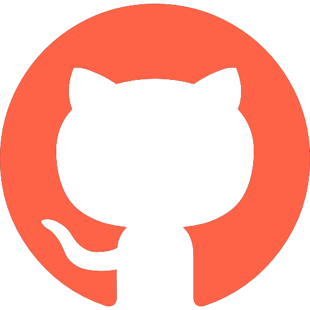

<em>Courses</em>

:::{layout="[5, 5]"}

:::{.card .mb-3}

:::{.card-body2}

[Getting started with &nbsp;{width="1.2em"}](top_intro.qmd){.card-title2 .stretched-link}

[A course on version control]{.text-muted}

:::

:::

:::{.card .mb-3}

:::{.card-body2}

[Collaborating on &nbsp;{width="1.2em"}](top_col.qmd){.card-title2 .stretched-link}

[A course on collaborative workflows]{.text-muted}

:::

:::

::::

<em>Webinars</em>

:::{layout="[5, 5, -5, -5]"}

:::{.card .mb-3}

:::{.card-body2}

[Data version control with{width="2.8em"}](wb_dvc.qmd){.card-title-ws .stretched-link}

:::

:::

:::{.card .mb-3}

:::{.card-body2}

[A great Git UI: Lazygit](wb_lazygit.qmd){.card-title-ws .stretched-link}

:::

:::

:::

<em>Workshops</em>

:::{layout="[5, 5, 5, -5]"}

:::{.card .mb-3}

:::{.card-body2}

[Searching a &nbsp;{width="1.2em"} project](practice_repo/ws_search.qmd){.card-title-ws .stretched-link}

:::

:::

:::{.card .mb-3}

:::{.card-body2}

[Collaborating through &nbsp;{width="1.2em"}](ws_collab.qmd){.card-title-ws .stretched-link}

:::

:::

:::{.card .mb-3}

:::{.card-body2}

[Contributing to projects](ws_contrib.qmd){.card-title-ws .stretched-link}

:::

:::

:::
