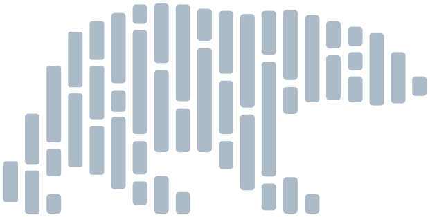
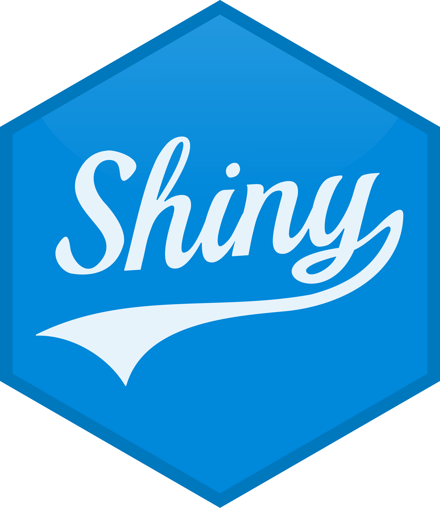
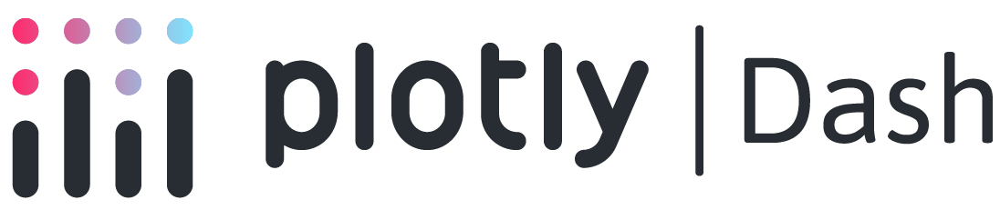
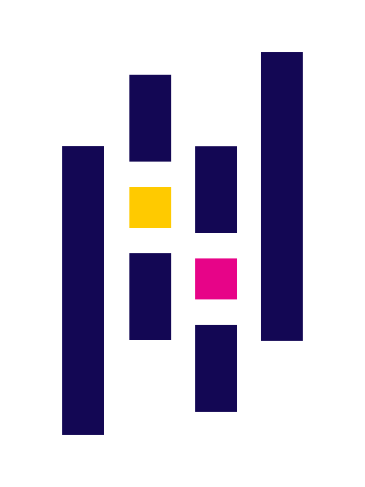
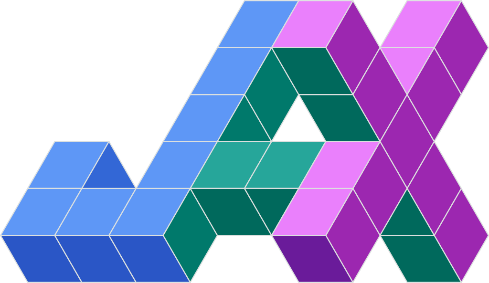

<em>Courses</em>

:::{layout="[[5, 5], [5, 5], [5, -5]]"}

:::{.card .mb-3}

:::{.card-body2}

[Getting started in &nbsp;{width="1.2em"}](top_intro.qmd){.card-title2 .stretched-link}

[An intro course to Python]{.button-subtitle}

:::

:::

:::{.card .mb-3}

:::{.card-body2}

[Learning &nbsp;{width="1.2em"} with LLMs](top_llm.qmd){.card-title2 .stretched-link}

[An intro course using LLMs]{.button-subtitle}

:::

:::

:::{.card .mb-3}

:::{.card-body2}

[Text analysis with {width="1.5em"}](top_nlp.qmd){.card-title2 .stretched-link}

[An introduction to NLP using TextBlob]{.button-subtitle}

:::

:::

:::{.card .mb-3}

:::{.card-body2}

[Faster DataFrames with &nbsp;{width="1.6em"}](hpc_polars.qmd){.card-title2 .stretched-link}

[Introduction to Polars]{.button-subtitle}

:::

:::

:::{.card .mb-3}

:::{.card-body2}

[GPU-accelerated &nbsp;{width="1.2em"}](hpc_gpu.qmd){.card-title2 .stretched-link}

[Several courses on Python GPU tools]{.button-subtitle}

:::

:::

:::

<em>Webinars</em>

:::{layout="[[5, 5, 5, 5], [5, 5, 5, -5]]"}

:::{.card .mb-3}

:::{.card-body2}

[`uv` package manager](wb_uv.qmd){.card-title-ws .stretched-link}

:::

:::

:::{.card .mb-3}

:::{.card-body2}

[Next-gen {width="1.8em"} notebooks](wb_marimo.qmd){.card-title-ws .stretched-link}

:::

:::

:::{.card .mb-3}

:::{.card-body2}

[Dashboards: {width="1.2em"} vs {width="4.3em"}](wb_shiny.qmd){.card-title-ws .stretched-link}

:::

:::

:::{.card .mb-3}

:::{.card-body2}

[RIP &nbsp;{width="1.1em"} Welcome &nbsp;{width="1.8em"}](wb_polars2.qmd){.card-title-ws .stretched-link}

:::

:::

:::{.card .mb-3}

:::{.card-body2}

[Faster DataFrames with &nbsp;{width="1.8em"}](wb_polars.qmd){.card-title-ws .stretched-link}

:::

:::

:::{.card .mb-3}

:::{.card-body2}

[Accelerated arrays & autodiff with {width="1.7em"}](wb_jax.qmd){.card-title-ws .stretched-link}

:::

:::

:::{.card .mb-3}

:::{.card-body2}

[Intro programming for HSS](wb_hss_prog.qmd){.card-title-ws .stretched-link}

:::

:::

:::

<em>Workshops</em>

:::{layout="[5, 5, 5, -5]"}

:::{.card .mb-3}

:::{.card-body2}

[Web scraping with &nbsp;{width="1.1em"}](ws_webscraping.qmd){.card-title-ws .stretched-link}

:::

:::

:::{.card .mb-3}

:::{.card-body2}

[DataFrames with &nbsp;{width="0.9em"}](ws_pandas.qmd){.card-title-ws .stretched-link}

:::

:::

:::{.card .mb-3}

:::{.card-body2}

[Playing with text &emsp;](ws_text.qmd){.card-title-ws .stretched-link}

:::

:::

:::
