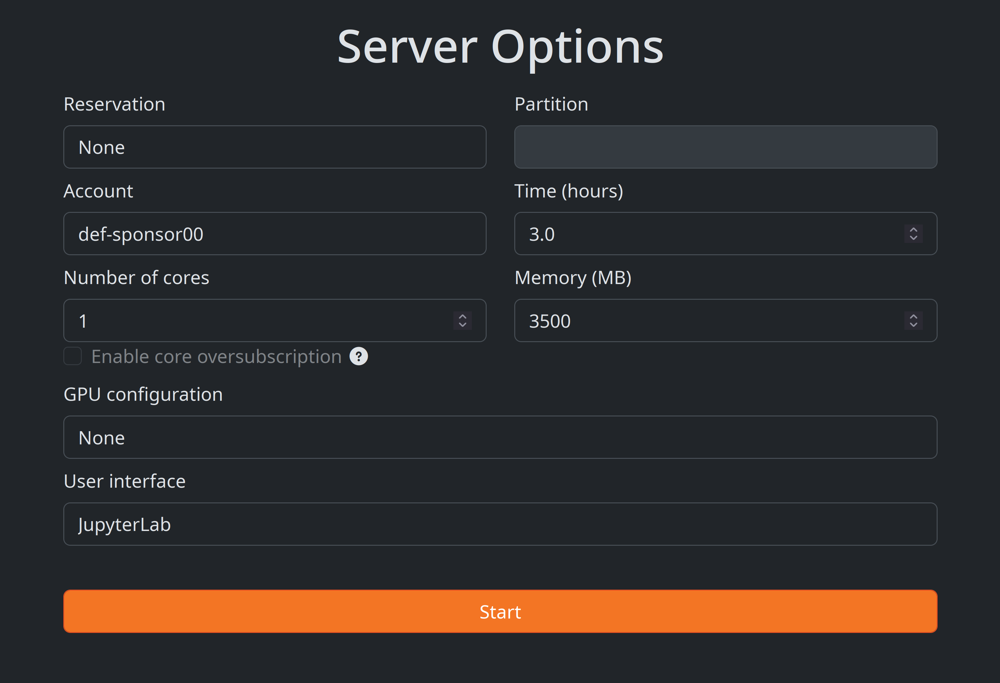

:::{.def}

For this course, we will use JupyterLab on a training cluster via JupyterHub—a set of tools that spawn and manage multiple instances of JupyterLab servers.

:::

:::{.note}

Note that, unlike other JupyterHubs you might have used (e.g. [Syzygy](https://syzygy.ca/)), this JupyterHub is not permanent and will be destroyed at the end of this course.

:::

## Get the info

During the course, we will give you 3 pieces of information:

- a link to a list of usernames,
- the URL of the JupyterHub for this course,
- the password to access that JupyterHub.

You need to claim a username by adding your first name or a pseudo next to a free username on the list to claim it.

[Your username is the name that was already on the list, NOT what you wrote next to it]{.emph} (which doesn't matter at all and only serves at signalling that this username is now taken).

Your username will look like `userxx`—`xx` being 2 digits—with **no space** and **no capital letter**.

## JupyterHub

### Log in

Open the JupyterHub URL we gave you in your browser, then use the username you claimed and the password we gave you to log in.

### Server options

<!-- In the [Server Options]{.codelike} page that opens, select what we tell you during the course. Please do not request more resources as this would prevent others to get access. -->

- Change the time to **3 h**.
- Change the memory to **3500 MB**.



If you would like to make a change to the information you entered on the server option page after you have pressed [start]{.codelike}, log out (click on [File]{.codelike} in the top menu and select [Log out]{.codelike} at the very bottom), log back in, edit the server options, and press start again.

### Start a Python notebook

To start a Jupyter notebook with the Python kernel, click on the button [Python 3]{.codelike} in the [Notebook]{.codelike} section (top row of buttons).

### Log out

[When you are done with a session in the JupyterHub, please log out.]{.emph} This releases the resources and makes them available to other people so it is a great habit to develop. It also prevents you from burning through your allocation unnecessarily.

To log out, click on [File]{.codelike} in the top menu and select [Log out]{.codelike} at the very bottom.

## The Jupyter interface

In a fashion Vi users will be familiar with, Jupyter notebooks come with two modes: **edit mode** in which you can type text as usual and **command mode** in which many keys are shortcuts to specific actions.

:::{.info}

**Here are some useful key bindings to navigate a Jupyter notebook:**

```{.bash}
Enter            enter edit mode
Esc              enter command mode

# in edit mode
Tab              code completion

# in command mode
up               navigate up
down             navigate up
Shift+up         select multiple cells up
Shift+down       select multiple cells down
a                insert a new blank cell above
b                insert a new blank cell below
c		         copy the current or selected cells
x		         cut the current or selected cells
v		         paste the copied or cut cells
dd				 delete cell
m		         turn the cell into a markdown cell
y		         turn the cell into a code cell
Shift+m	         merge selected cells

# in either mode
Ctl+Enter        run the current cell
Shift+Enter      run the current cell and move to a new cell below
```

:::
