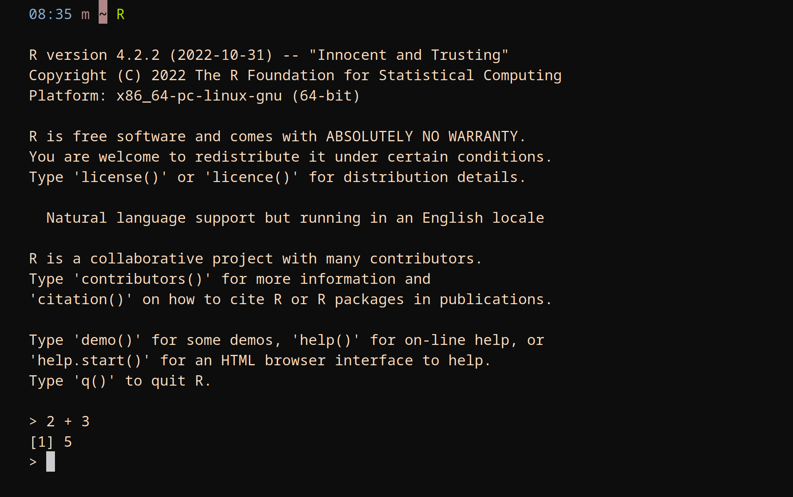
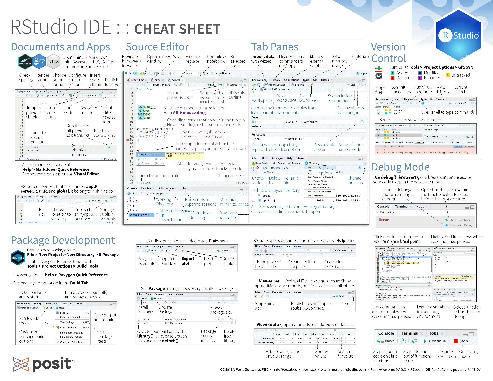
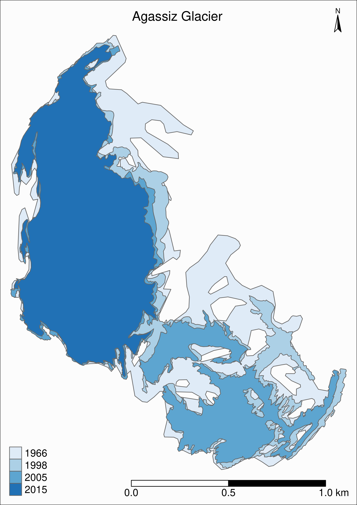
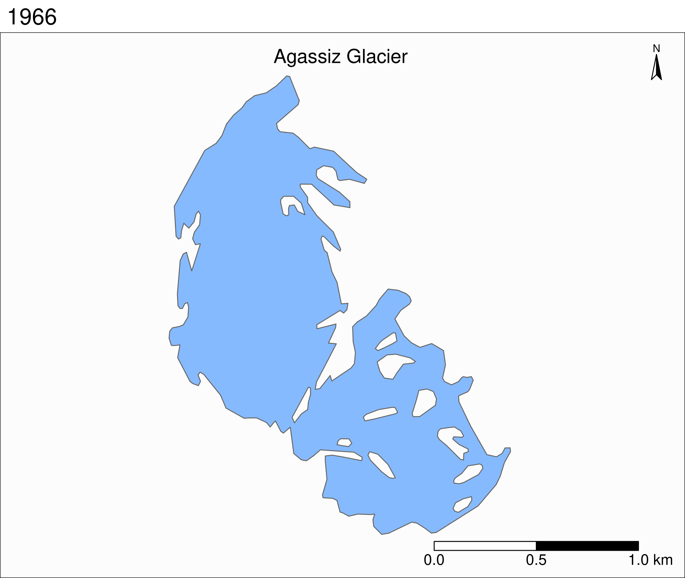

:::{.def}

*Content from [the workshop slides](ws_demo_slides.qmd) for easier browsing.*

:::

## A few words about R

### History

R was created by academic statisticians [Ross Ihaka](https://en.wikipedia.org/wiki/Ross_Ihaka) and [Robert Gentleman](https://en.wikipedia.org/wiki/Robert_Gentleman_(statistician)). The name comes from the language S which was a great influence as well as the first initial of the developers.

It was launched in 1993 and has been a [GNU Project](https://en.wikipedia.org/wiki/GNU_Project) since 1997.

### Why R?

- Free and open source.
- High-level and easy to learn.
- Large community.
- Very well documented.
- Unequalled number of statistics and modelling packages.
- Integrated package manager.
- Easy connection with fast compiled languages such as C and C++.
- Powerful IDEs (e.g. [RStudio](https://posit.co/download/rstudio-desktop/), [ESS](https://ess.r-project.org/), [Jupyter](https://jupyter.org/)).

### For whom?

R is particularly useful in data science fields with heavy statistics, modelling, or Bayesian inference such as biology, linguistics, economics, or statistics.

### Downsides

- Inconsistent syntax full of quirks.
- Slow.
- Large memory usage.

## Running R

### An interpreted language

R being an interpreted language, it can be run non-interactively or interactively.

### Running R non-interactively

If you write code in a text file (called a script), you can then execute it with:

```{.r}
Rscript my_script.R
```

:::{.note}

The command to execute scripts is `Rscript` rather than `R`. \
By convention, R scripts take the extension `.R`

:::

### Running R interactively

There are several ways to run R interactively:

- directly in the **console** (the name for the R shell),
- in **[Jupyter](https://jupyter.org/)** with the R kernel ([IRkernel package](https://cran.rstudio.com/web/packages/IRkernel/index.html)),
- in **another IDE** (e.g. in Emacs with [ESS](https://ess.r-project.org/)),
- in the **RStudio IDE**.

#### The R console

{width="80%"}

#### RStudio

[Posit](https://posit.co/) (formerly RStudio Inc.) developed a great and very popular IDE called [RStudio](https://posit.co/download/rstudio-desktop/). Here is its cheatsheet (click on it to download it):

[](https://opensource.posit.co/resources/cheatsheets/rstudio-ide/)

](img/rstudio-ide_2.jpg)

## A few basics

### Documentation

The R documentation is excellent. Get info on any function with `?` (e.g. `?sum`).

### Basic operations

```{r}
a <- 5
c <- c(2, 4, 1)
c * 5
sum(c)
```

### A statistics language

R really shines when it comes to statistics and modelling, so we will spend the rest of the hour diving into very complex and heavy Bayesian statistics.

Just kidding 🙂. In this demo, I will stick to fun topics.

## Data visualization

We will use [the ggplot2 package](https://github.com/tidyverse/ggplot2).

:::{.note}

You can find the `ggplot2` cheatsheet [here](https://opensource.posit.co/resources/cheatsheets/data-visualization/).

:::

### Datasets

R comes with a number of datasets. You can get a list by running `data()`. The `ggplot2` package provides [additional ones](https://ggplot2.tidyverse.org/reference/#data), such as the `mpg` dataset:

```{r}
library(ggplot2)
head(mpg, 4)  # we are printing only the first 4 rows
```

### Font size

The font size can be configured. To set the general font size, you can pass a value to `base_size` in the argument of the theme you are using. The default theme is `theme_grey` (we will see more about themes later):

```{r}
theme_set(theme_grey(base_size = 8))
```

### The Canvas

The first component is the data:

```{r}
ggplot(data = mpg)
```

:::{.note}

This can be simplified into `ggplot(mpg)`.

:::

The second component sets the way variables are mapped on the axes. This is done with the `aes()` (aesthetics) function:

```{r}
ggplot(data = mpg, mapping = aes(x = displ, y = hwy))
```

:::{.note}

This can be simplified into `ggplot(mpg, aes(displ, hwy))`.

:::

### Geometric representations

Onto this canvas, we can add "geoms" (geometrical objects) representing the data. The type of "geom" defines the type of representation (e.g. boxplot, histogram, bar chart).

To represent the data as a scatterplot, we use the `geom_point()` function:

```{r}
ggplot(mpg, aes(x = displ, y = hwy)) +
  geom_point()
```

We can colour-code the points in the scatterplot based on the `drv` variable, showing the lower fuel efficiency of 4WD vehicles:

```{r}
ggplot(mpg, aes(x = displ, y = hwy)) +
  geom_point(aes(color = drv))
```

Or we can colour-code them based on the `class` variable:

```{r}
ggplot(mpg, aes(x = displ, y = hwy)) +
  geom_point(aes(color = class))
```

Multiple "geoms" can be added on top of each other. For instance, we can add a smoothed conditional means function that aids at seeing patterns in the data with `geom_smooth()`:

```{r}
ggplot(mpg, aes(x = displ, y = hwy)) +
  geom_point(aes(color = class)) +
  geom_smooth()
```

Thanks to the colour-coding of the types of car, we can see that the cluster of points in the top right corner all belong to the same type: 2 seaters. Those are outliers with high power, yet high few efficiency due to their smaller size.

The default smoothing function uses the LOESS (locally estimated scatterplot smoothing) method, which is a nonlinear regression. But maybe a linear model would actually show the general trend better. We can change the method by passing it as an argument to `geom_smooth()`:

```{r}
ggplot(mpg, aes(x = displ, y = hwy)) +
  geom_point(aes(color = class)) +
  geom_smooth(method = lm)
```

Of course, we could apply the smoothing function to each class instead of the entire data. It creates a busy plot but shows that the downward trend remains true within each type of car:

```{r}
ggplot(mpg, aes(x = displ, y = hwy, color = class)) +
  geom_point(aes(color = class)) +
  geom_smooth(method = lm)
```

Other arguments to `geom_smooth()` can set the line width, color, or whether or not the standard error (`se`) is shown:

```{r}
ggplot(mpg, aes(x = displ, y = hwy)) +
  geom_point(aes(color = class)) +
  geom_smooth(
    method = lm,
    se = FALSE,
    color = "#999999",
    linewidth = 0.5
  )
```

### Colour scales

If we want to change the colour scale, we add another layer for this:

```{r}
ggplot(mpg, aes(x = displ, y = hwy)) +
  geom_point(aes(color = class)) +
  scale_color_brewer(palette = "Dark2") +
  geom_smooth(
    method = lm,
    se = FALSE,
    color = "#999999",
    linewidth = 0.5
  )
```

`scale_color_brewer()`, based on [color brewer 2.0](https://colorbrewer2.org/#type=sequential&scheme=BuGn&n=3), is one of many methods to change the color scale. Here is the list of available scales for this particular method:

{width="90%"}

### Labels

We can keep on adding layers. For instance, the `labs()` function allows to set title, subtitle, captions, tags, axes labels, etc.

```{r}
ggplot(mpg, aes(x = displ, y = hwy)) +
  geom_point(aes(color = class)) +
  scale_color_brewer(palette = "Dark2") +
  geom_smooth(
    method = lm,
    se = FALSE,
    color = "#999999",
    linewidth = 0.5
  ) +
  labs(
    title = "Fuel consumption per engine size on highways",
    x = "Engine size (L)",
    y = "Fuel economy (mpg) on highways",
    color = "Type of car",
    caption = "EPA data from https://fueleconomy.gov/"
  )
```

### Themes

Another optional layer sets one of several preset themes.

[Edward Tufte](https://en.wikipedia.org/wiki/Edward_Tufte) developed, amongst others, the principle of *data-ink ratio* which emphasizes that ink should be used primarily where it communicates meaningful messages. It is indeed common to see charts where more ink is used in labels or background than in the actual representation of the data.

The default `ggplot2` theme could be criticized as not following this principle. Let's change it:

```{r}
ggplot(mpg, aes(x = displ, y = hwy)) +
  geom_point(aes(color = class)) +
  scale_color_brewer(palette = "Dark2") +
  geom_smooth(
    method = lm,
    se = FALSE,
    color = "#999999",
    linewidth = 0.5
  ) +
  labs(
    title = "Fuel consumption per engine size on highways",
    x = "Engine size (L)",
    y = "Fuel economy (mpg) on highways",
    color = "Type of car",
    caption = "EPA data from https://fueleconomy.gov/"
  ) +
  theme_classic(base_size = 8)
```

The `theme()` function allows to tweak the theme in any number of ways. For instance, what if we don't like the default position of the title and we would rather have it centered?

```{r}
ggplot(mpg, aes(x = displ, y = hwy)) +
  geom_point(aes(color = class)) +
  scale_color_brewer(palette = "Dark2") +
  geom_smooth(
    method = lm,
    se = FALSE,
    color = "#999999",
    linewidth = 0.5
  ) +
  labs(
    title = "Fuel consumption per engine size on highways",
    x = "Engine size (L)",
    y = "Fuel economy (mpg) on highways",
    color = "Type of car",
    caption = "EPA data from https://fueleconomy.gov/"
  ) +
  theme_classic(base_size = 8) +
  theme(plot.title = element_text(hjust = 0.5))
```

We can also move the legend to give more space to the actual graph:

```{r}
ggplot(mpg, aes(x = displ, y = hwy)) +
  geom_point(aes(color = class)) +
  scale_color_brewer(palette = "Dark2") +
  geom_smooth(
    method = lm,
    se = FALSE,
    color = "#999999",
    linewidth = 0.5
  ) +
  labs(
    title = "Fuel consumption per engine size on highways",
    x = "Engine size (L)",
    y = "Fuel economy (mpg) on highways",
    color = "Type of car",
    caption = "EPA data from https://fueleconomy.gov/"
  ) +
  theme_classic(base_size = 8) +
  theme(plot.title = element_text(hjust = 0.5), legend.position = "bottom")
```

As you could see, `ggplot2` works by adding a number of layers on top of each other, all following a standard set of rules, or "grammar". This way, a vast array of graphs can be created by organizing simple components.

### ggplot2 extensions

Thanks to its vast popularity, `ggplot2` has seen a proliferation of packages extending its capabilities.

#### Combining plots

For instance the [`patchwork`](https://patchwork.data-imaginist.com/) package allows to easily combine multiple plots on the same frame.

Let's add a second plot next to our plot. To add plots side by side, we simply add them to each other. We also make a few changes to the labels to improve the plots integration:

```{r}
library(patchwork)

ggplot(mpg, aes(x = displ, y = hwy)) +        # First plot
  geom_point(aes(color = class)) +
  scale_color_brewer(palette = "Dark2") +
  geom_smooth(
    method = lm,
    se = FALSE,
    color = "#999999",
    linewidth = 0.5
  ) +
  labs(
    x = "Engine size (L)",
    y = "Fuel economy (mpg) on highways",
    color = "Type of car"
  ) +
  theme_classic(base_size = 8) +
  theme(
    plot.title = element_text(hjust = 0.5),
    legend.position.inside = c(0.7, 0.75),           # Better legend position
    legend.background = element_rect(         # Add a frame to the legend
      linewidth = 0.1,
      linetype = "solid",
      colour = "black"
    )
  ) +
  ggplot(mpg, aes(x = displ, y = hwy)) +      # Second plot
  geom_point(aes(color = drv)) +
  scale_color_brewer(palette = "Dark2") +
  labs(
    x = "Engine size (L)",
    y = element_blank(),                      # Remove redundant label
    color = "Type of drive train",
    caption = "EPA data from https://fueleconomy.gov/"
  ) +
  theme_classic(base_size = 8) +
  theme(
    plot.title = element_text(hjust = 0.5),
    legend.position.inside = c(0.7, 0.87),
    legend.background = element_rect(
      linewidth = 0.1,
      linetype = "solid",
      colour = "black"
    )
  )
```

#### Extensions list

Another popular extension is the [`gganimate`](https://gganimate.com/) package which allows to create data animations.

A full list of extensions for `ggplot2` is shown below ([here](https://exts.ggplot2.tidyverse.org/gallery/) is the website):

```{=html}
<iframe width="690" height="1000" src="https://exts.ggplot2.tidyverse.org/gallery/"></iframe>
```

## Web scraping

### HTML and CSS

[HyperText Markup Language](https://en.wikipedia.org/wiki/HTML) (HTML) is the standard markup language for websites: it encodes the information related to the formatting and structure of webpages. Additionally, some of the customization can be stored in [Cascading Style Sheets](https://en.wikipedia.org/wiki/CSS) (CSS) files.

HTML uses tags of the form:

```{.html}
<some_tag>Your content</some_tag>
```

Some tags have attributes:

```{.html}
<some_tag attribute_name="attribute value">Your content</some_tag>
```

:::{.example}

Examples:

:::

- `<h2>This is a heading of level 2</h2>`
- `<b>This is bold</b>`
- `<a href="https://some.url">This is the text for a link</a>`

### Example for this workshop

We will use [a website](https://trace.tennessee.edu/utk_graddiss/index.html) from the [University of Tennessee](https://www.utk.edu/) containing a database of PhD theses from that university.

Our goal is to scrape data from this site to produce a dataframe with the date, major, and advisor for each dissertation.

:::{.note}

We will only do this for the first page which contains the links to the 100 most recent theses. If you really wanted to gather all the data, you would have to do this for all pages.

:::

### Package

To do all this, we will use the package [rvest](https://cran.r-project.org/web/packages/rvest/index.html), part of the [tidyverse](https://www.tidyverse.org/) (a modern set of R packages). It is a package influenced by the popular Python package [Beautiful Soup](https://en.wikipedia.org/wiki/Beautiful_Soup_(HTML_parser)) and it makes scraping websites with R really easy.

Let's load it:

```{.r}
library(rvest)
```

### Read in HTML from main site

As mentioned above, our site is the [database of PhD dissertations from the University of Tennessee](https://trace.tennessee.edu/utk_graddiss/index.html). Let's create a character vector with the URL:

```{.r}
url <- "https://trace.tennessee.edu/utk_graddiss/index.html"
```

First, we read in the html data from that page:

```{.r}
html <- read_html(url)
```

Let's have a look at the raw data:

```{.r}
html
```

```
{html_document}
<html lang="en">
[1] <head>\n<meta http-equiv="Content-Type" content="text/html; charset=UTF-8 ...
[2] <body>\n<!-- FILE /srv/sequoia/main/data/trace.tennessee.edu/assets/heade ...
```

### Extract all URLs

```{.r}
dat <- html %>% html_elements(".article-listing a")
dat[1:6]
```

```
{xml_nodeset (6)}
[1] <a href="https://trace.tennessee.edu/utk_graddiss/12328">Essays in Macroe ...
[2] <a href="https://trace.tennessee.edu/utk_graddiss/12671">UNDERSTANDING AN ...
[3] <a href="https://trace.tennessee.edu/utk_graddiss/12672">Soil Nitrous Oxi ...
[4] <a href="https://trace.tennessee.edu/utk_graddiss/12329">CHARACTERIZATION ...
[5] <a href="https://trace.tennessee.edu/utk_graddiss/12330">View from the To ...
[6] <a href="https://trace.tennessee.edu/utk_graddiss/12331">Exploration of V ...
```

We now have a list of lists.

Before running for loops, it is important to initialize empty loops. It is much more efficient than growing the result at each iteration. So let's initialize an empty list that we call `list_urls` of the appropriate size:

```{.r}
list_urls <- vector("list", length(dat))
```

Now we can run a loop to fill in our list:

```{.r}
for (i in seq_along(dat)) {
  list_urls[[i]] <- dat[[i]] %>% html_attr("href")
}
```

Let's print again the first element of `list_urls` to make sure all looks good:

```{.r}
list_urls[[1]]
```

```
[1] "https://trace.tennessee.edu/utk_graddiss/12328"
```

We now have a list of URLs (in the form of character vectors) as we wanted.

### Extract data from each page

We will now extract the data (date, major, and advisor) for all URLs in our list.

Again, before running a for loop, we need to allocate memory first by creating an empty container (here a list):

```{.r}
list_data <- vector("list", length(list_urls))

for (i in seq_along(list_urls)) {
  html <- read_html(list_urls[[i]])
  date <- html %>%
    html_element("#publication_date p") %>%
    html_text2()
  major <- html %>%
    html_element("#department p") %>%
    html_text2()
  advisor <- html %>%
    html_element("#advisor1 p") %>%
    html_text2()
  Sys.sleep(0.1)  # Add a little delay
  list_data[[i]] <- cbind(date, major, advisor)
}
```

### Store results in DataFrame

We can turn this big list into a dataframe:

```{.r}
result <- do.call(rbind.data.frame, list_data)
```

We can capitalize the headers:

```{.r}
names(result) <- c("Date", "Major", "Advisor")
```

### Our final data

`result` is a long dataframe, so we will only print the first few elements:

```{.r}
head(result, 6)
```

```
    Date                                           Major               Advisor
1 5-2025                                       Economics     Andrew, S, Hanson
2 8-2025                               Civil Engineering Nicholas E. Wierschem
3 8-2025          Plant, Soil and Environmental Sciences         Debasish Saha
4 5-2025 Biochemistry and Cellular and Molecular Biology              Jae Park
5 5-2025                 Higher Education Administration       Pamella Angelle
6 5-2025                                            <NA>        Andrea S. Lear
```

### Save results to file

If we wanted, we could save our data to a CSV file:

```{.r}
write.csv(result, "dissertations_data.csv", row.names = FALSE)
```

## GIS mapping

### Data reading and manipulation

- Spatial vectors: great modern packages are [sf](https://github.com/r-spatial/sf) or [terra](https://github.com/rspatial/terra).
- Raster data: the package [terra](https://github.com/rspatial/terra).

I will skip the data preparation due to lack of time, but you can look at the code in [this webinar](wb_gis_mapping#example-glaciers-melt-in-north-america.qmd) or [this workshop](ws_gis_intro.qmd).

### Mapping data

Good options to create maps include [ggplot2](https://github.com/tidyverse/ggplot2) (the package we already used for plotting) and [tmap](https://github.com/mtennekes/tmap).

### Map of glaciers in western North America

```{.r}
tm_shape(states, bbox = nwa_bbox) +
  tm_polygons(col = "#f2f2f2", lwd = 0.2) +
  tm_shape(ak) +
  tm_borders(col = "#3399ff") +
  tm_fill(col = "#86baff") +
  tm_shape(wes) +
  tm_borders(col = "#3399ff") +
  tm_fill(col = "#86baff") +
  tm_layout(
    title = "Glaciers of Western North America",
    title.position = c("center", "top"),
    title.size = 1.1,
    bg.color = "#fcfcfc",
    inner.margins = c(0.06, 0.01, 0.09, 0.01),
    outer.margins = 0,
    frame.lwd = 0.2
  ) +
  tm_compass(
    type = "arrow",
    position = c("right", "top"),
    size = 1.2,
    text.size = 0.6
  ) +
  tm_scale_bar(
    breaks = c(0, 1000, 2000),
    position = c("right", "BOTTOM")
  )
```

{fig-align="center"}

### Multi-layer map of the retreat of a glacier

```{.r}
tm_shape(ag) +
  tm_polygons("year", palette = "Blues") +
  tm_layout(
    title = "Agassiz Glacier",
    title.position = c("center", "top"),
    legend.position = c("left", "bottom"),
    legend.title.color = "#fcfcfc",
    legend.text.size = 1,
    bg.color = "#fcfcfc",
    inner.margins = c(0.07, 0.03, 0.07, 0.03),
    outer.margins = 0
  ) +
  tm_compass(
    type = "arrow",
    position = c("right", "top"),
    text.size = 0.7
  ) +
  tm_scale_bar(
    breaks = c(0, 0.5, 1),
    position = c("right", "BOTTOM"),
    text.size = 1
  )
```

{width="70%" fig-align="center"}

### Animated map of the retreat of a glacier

```{.r}
tmap_animation(tm_shape(ag) +
                 tm_polygons(col = "#86baff") +
                 tm_layout(
                   title = "Agassiz Glacier",
                   title.position = c("center", "top"),
                   legend.position = c("left", "bottom"),
                   legend.title.color = "#fcfcfc",
                   legend.text.size = 1,
                   bg.color = "#fcfcfc",
                   inner.margins = c(0.08, 0, 0.08, 0),
                   outer.margins = 0,
                   panel.label.bg.color = "#fcfcfc"
                 ) +
                 tm_compass(
                   type = "arrow",
                   position = c("right", "top"),
                   text.size = 0.7
                 ) +
                 tm_scale_bar(
                   breaks = c(0, 0.5, 1),
                   position = c("right", "BOTTOM"),
                   text.size = 1
                 ) +
                 tm_facets(
                   along = "year",
                   free.coords = F
                 )filename = "ag.gif",
               dpi = 300,
               inner.margins = c(0.08, 0, 0.08, 0),
               delay = 100
```

{width="70%" fig-align="center"}
