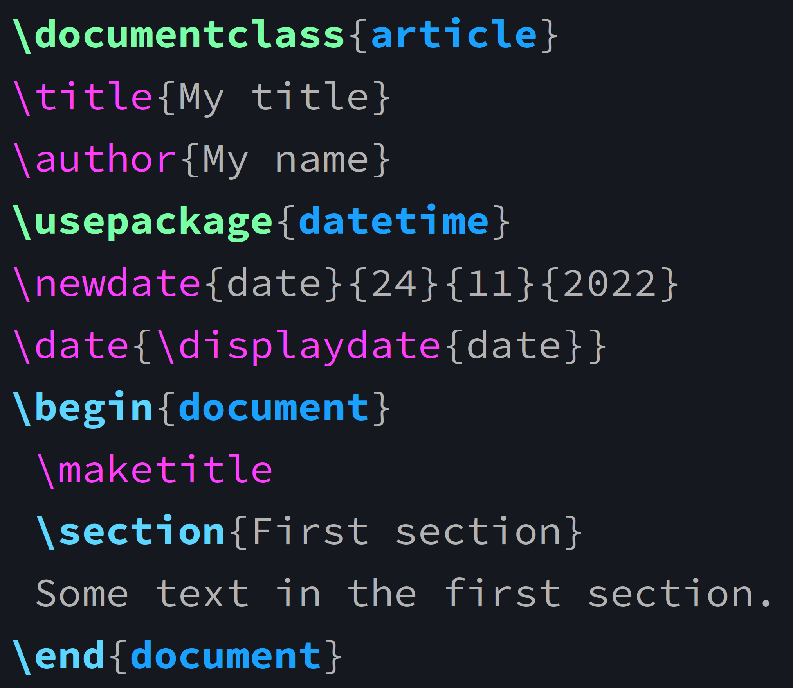
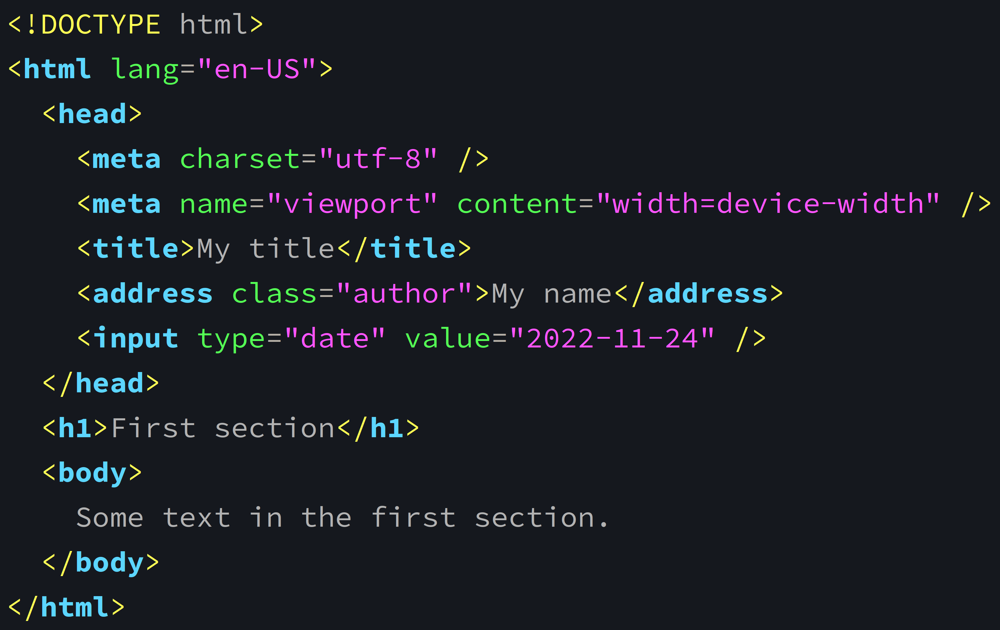
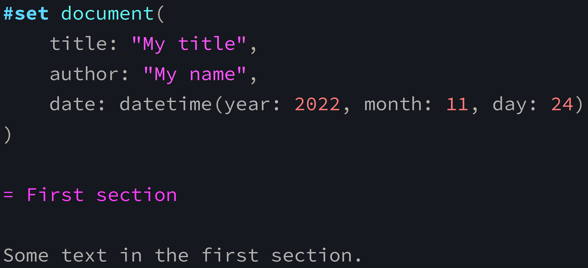
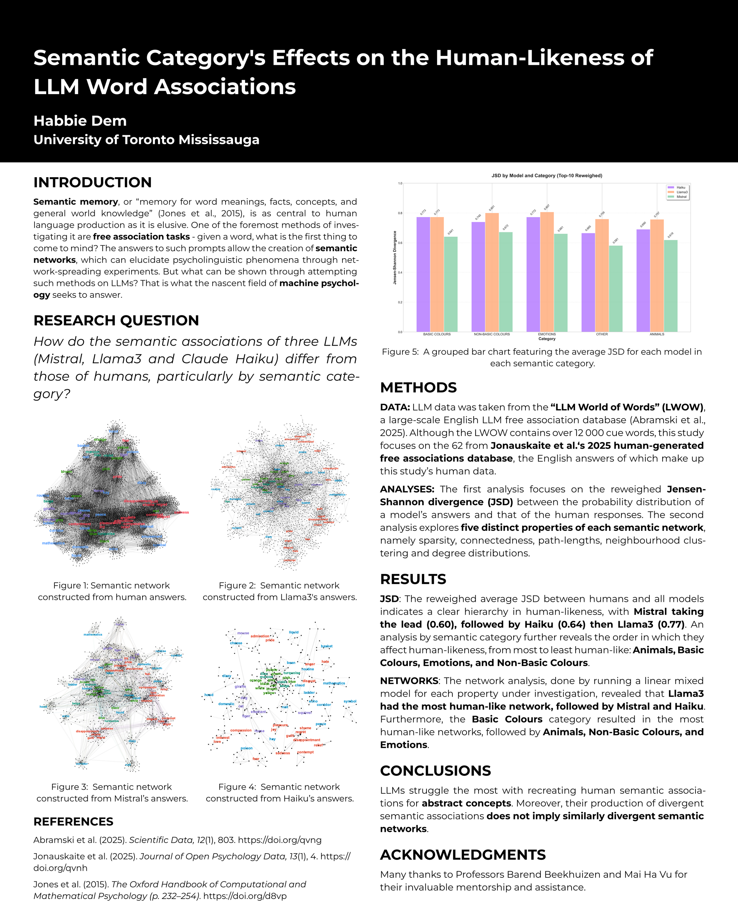
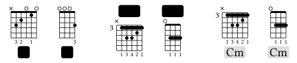
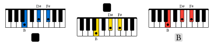

:::{.def}

*Content from [the webinar slides](wb_typst_slides.qmd) for easier browsing.*

:::

## Markup languages

Markup languages define the formatting of documents. They are rendered by software.

:::{.example}

Examples of markup languages:

:::

- [HTML](https://en.wikipedia.org/wiki/HTML) (HyperText Markup Language) is a declarative, static markup language for creating web documents.
- [TeX](https://en.wikipedia.org/wiki/TeX) is a procedural, Turing complete markup language for typesetting PDF documents. ([LaTeX](https://en.wikipedia.org/wiki/LaTeX) is a set of macros built on it, making it easier to use).
- [Markdown](https://en.wikipedia.org/wiki/Markdown) is a more recent, simple, easy to read and write markup language that can be used for both web and PDF. It is more limited than either HTML or LaTeX, but it can incorporate raw HTML and LaTeX code.

### Example in LaTeX

```{.latex}
\documentclass{article}
\title{My title}
\author{My name}
\usepackage{datetime}
\newdate{date}{24}{11}{2022}
\date{\displaydate{date}}
\begin{document}
 \maketitle
 \section{First section}
 Some text in the first section.
\end{document}
```

### Same example in HTML

```{.html}
<!DOCTYPE html>
<html lang="en-US">
  <head>
	<meta charset="utf-8" />
	<meta name="viewport" content="width=device-width" />
	<title>My title</title>
	<address class="author">My name</address>
	<input type="date" value="2022-11-24" />
  </head>
  <h1>First section</h1>
  <body>
	Some text in the first section.
  </body>
</html>
```

### Typst

A new markup language for typesetting documents (mostly a LaTeX replacement).

Exports to PDF, HTML, PNG, SVG.

[Live preview]{.emph} thanks to its [extremely fast open-source compiler written in Rust]{.emph} and to [incremental compilation]{.emph}.

Has a modern programming language feel (modules, functions, variables, arrays).

Supported by [pandoc](https://github.com/jgm/pandoc).

<!-- [Cool post](https://jbirnick.net/posts/typesetting-comparison/) by Johann Birnick -->

<!-- [A good comparison](https://www.underleaf.ai/blog/typst-vs-latex) by the popular [Underleaf AI](https://www.underleaf.ai/) company (which has no business interest in promoting Typst!) -->

[Informative and actionable error messages!]{.emph}

### Previous example in Typst

```{.typ}
#set document(
	title: "My title",
	author: "My name",
	date: datetime(year: 2022, month: 11, day: 24)
)

= First section

Some text in the first section.
```

### Let's compare

::::{.columns}

:::{.column width="23%"}



:::

:::{.column width="41%"}



:::

:::{.column width="36%"}



:::

::::

### Limitations

:::{.emph}

Currently few journals and conferences accept Typst documents.

:::

Package ecosystem smaller than LaTeX's (but growing fast).

No direct equivalent to [MathJax](https://github.com/mathjax/MathJax) to use Typst math as is for HTML (but increasing integration with [MathML](https://en.wikipedia.org/wiki/MathML)).

:::{.note}

[This thread](https://forum.typst.app/t/does-mathjax-katex-like-math-typesetting-for-the-web-but-with-typst-math-syntax-exist/5557/6) has suggestions and regular updates on this.

:::

## How to use Typst?

### Web app

Typst comes with [a web app](https://typst.app/) (requires sign in, [free and pro versions](https://typst.app/pricing/)). It provides live preview, syntax highlighting, autocompletion, storage (and collaboration in paid version).

Equivalent to [Overleaf](https://en.wikipedia.org/wiki/Overleaf) for Typst (with the speed of course).

### CLI

[Open-source CLI utility](https://github.com/typst/typst). You can [download the binaries or install it via your package manager or via Rust's `cargo`](https://github.com/typst/typst#installation).

Write text files with `.typ` extension in your favourite text editor.

### Text editors integrations

::::{.columns}

:::{.column width="19%"}

**VS Code** \
**Vim/Neovim** \
**Helix** \
**Emacs** \
**Quarto**

:::

:::{.column width="2%"}
:::

:::{.column width="79%"}

[Tinymist](https://github.com/Myriad-Dreamin/tinymist) LSP extension \
Available typst.vim/nvim plugins \
[Tinymist](https://github.com/Myriad-Dreamin/tinymist) LSP extension \
`typst-ts-mode` for Tree-sitter, [tinymist](https://github.com/Myriad-Dreamin/tinymist) for LSP \
Integrated out of the box

:::

::::

### Commands

Compile your source file with:

```{.bash}
typst compile <your_file.typ>  # creates PDF
```

Or compile and watch it with:

```{.bash}
typst watch <your_file.typ>	   # incremental compilation on changes
```

### Help

For general info:

```{.bash}
typst help
```

And for options on sub-command:

```{.bash}
typst help <command>
```

:::{.example}

Example:

:::

```{.bash}
typst help watch
```

### Automatic PDF refresh

If you use a PDF viewer that does not automatically refresh on changes, you can force it to do so.

Here is an example Bash function that opens a file with `mupdf` (replace by the viewer of your choice) and automatically refreshes it:

```{.bash}
livepdf () {
	mupdf "$1" &
	echo "$1" | entr -p pkill -HUP mupdf
}
```

Use it with:

```{.bash}
livepdf your_pdf.pdf
```

## Syntax

### Markup

::::{.columns}

:::{.column width="49%"}

```{.typ}
= Header level 1
== Header level 2
=== Header level 3
_italic_, *bold*, `monospace`

// Full-line comment
Some text  // End of line comment

Adding a \
line break
```

:::

:::{.column width="2%"}
:::

:::{.column width="49%"}

```{.typ}
Inline equation: $e^(-2 pi i x xi)$

Block equation: $ e^(-2 pi i x xi) $

+ Numbered list item 1
+ Numbered list item 2
	- Nested unnumbered item
	- Nested unnumbered item
		- More nesting unnumbered
		- More nesting unnumbered
```

:::

::::

### Programming-like syntax

::::{.columns}

:::{.column width="39%"}

```{.typ}
// Functions
#image("img/wren.jpg")

// Variables
#let // Tests
#(1 < 2)

// Math functions
#calc.pow(-5, 2)
```

:::

:::{.column width="2%"}
:::

:::{.column width="59%"}

```{.typ}
// Dictionaries
#let capitals = (
    France: "Paris",
    Japan: "Tokyo",
    Canada: "Ottawa"
)

// Loops
#for (country, capital) in capitals [
    - #capital is the capital of #country.
]
```

:::

::::

### Citations

Typst uses the [hayagriva](https://github.com/typst/hayagriva) bibliography manager (written in Rust) with YAML files, which is compatible with BibTex.

## Packages

### Presentations

- [polylux](https://github.com/polylux-typ/polylux)
- [touying](https://github.com/touying-typ/touying)
- [typst-pinit](https://github.com/OrangeX4/typst-pinit) for equations labelling

### Graphics

[CeTZ](https://github.com/cetz-package/cetz), inspired by [TikZ](https://github.com/pgf-tikz/Pisonia grandis):

<iframe width="690" height="600" src="https://diagrams.janosh.dev/" data-external="1"></iframe>

### Academic posters

[peace-of-posters](https://jonaspleyer.github.io/peace-of-posters/showcase/):

{width="70%"}

### Music

[typst-chords](https://github.com/ljgago/typst-chords):

::::{.columns}

:::{.column width="49%"}



:::

:::{.column width="2%"}
:::

:::{.column width="49%"}



:::

::::

### Games 🤔

- Dis you say [Tetris](https://typst.app/universe/package/soviet-matrix/)?

## Resources

- [Official documentation](https://typst.app/docs/)
- [Typst universe](https://typst.app/universe/)
- [Templates](https://typst.app/universe/search/?kind=templates)
- [Packages](https://typst.app/universe/search/?kind=packages)
- [Discourse forum](https://forum.typst.app/)
- [Discord](https://discord.com/invite/typst-1054443721975922748)
- [Blog](https://typst.app/blog/)
- [Awesome-typst repo](https://github.com/qjcg/awesome-typst)
- Usage in Emacs: [typst-ts-mode](https://codeberg.org/meow_king/typst-ts-mode); preview with [typst-preview.el](https://github.com/havarddj/typst-preview.el) or [tip](https://git.sr.ht/~mafty/tip)
- [Tinymist](https://github.com/Myriad-Dreamin/tinymist): integrated language service for Typst
